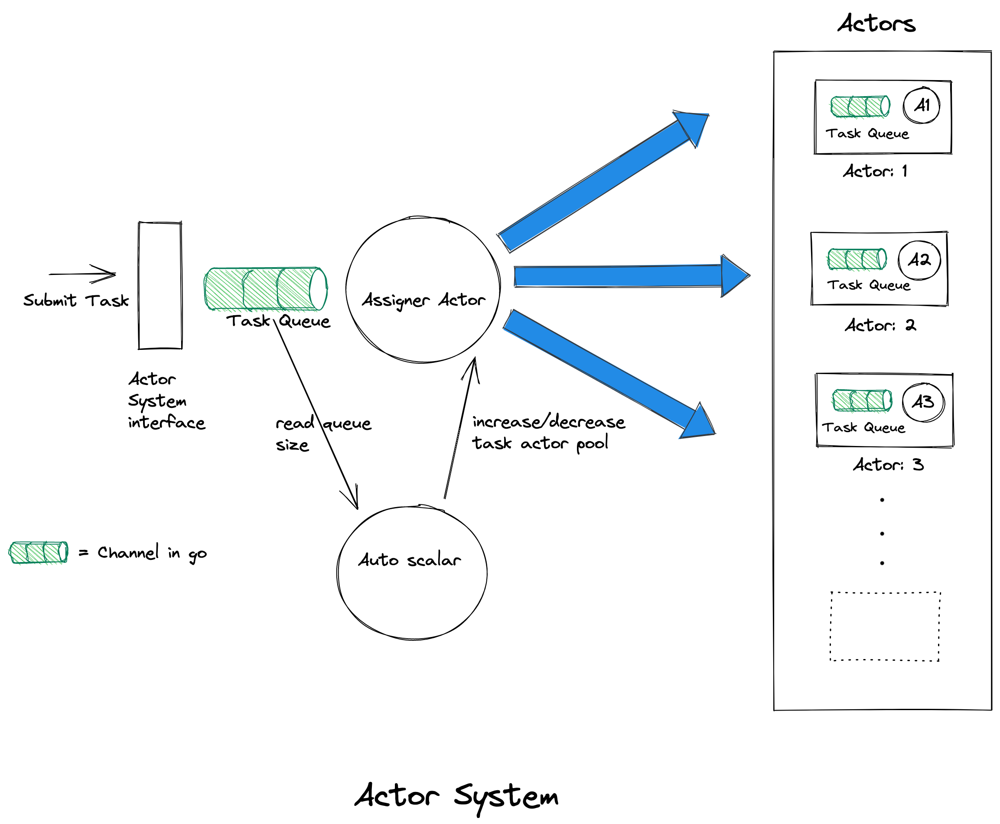

# Implementing Go Actor System

Actors are objects which encapsulate state and behavior, they communicate exclusively by exchanging messages which are placed into the recipient’s queue.
Read more about it [here](https://en.wikipedia.org/wiki/Actor_model).

Read more about this project implementation in [this article](https://medium.com/better-programming/implementing-the-actor-model-in-golang-3579c2227b5e)

**Architecture**




To use actor model:
Import the repo in your project and use it as done in [actor_system_test.go](https://github.com/gauravsa/go-actor-system/blob/main/actor_system/actor_system_test.go)


*sample code* 
```go
func TestIOSimulationSystem(t *testing.T) {
	ioSimSystem := CreateActorSystem("io_sim", &actor.Config{
		MinActor: 10,
		MaxActor: 100,
		AutoScale: actor.AutoScale{
			UpscaleQueueSize:   100,
			DownscaleQueueSize: 10,
		},
	})

	for i := 0; i < 1000; i += 1 {
		ioSimSystem.SubmitTask(CreateNumberPrinterTask(i))
		<-time.After(2 * time.Millisecond)
	}
	shutdown([]*ActorSystem{ioSimSystem})

}
```


